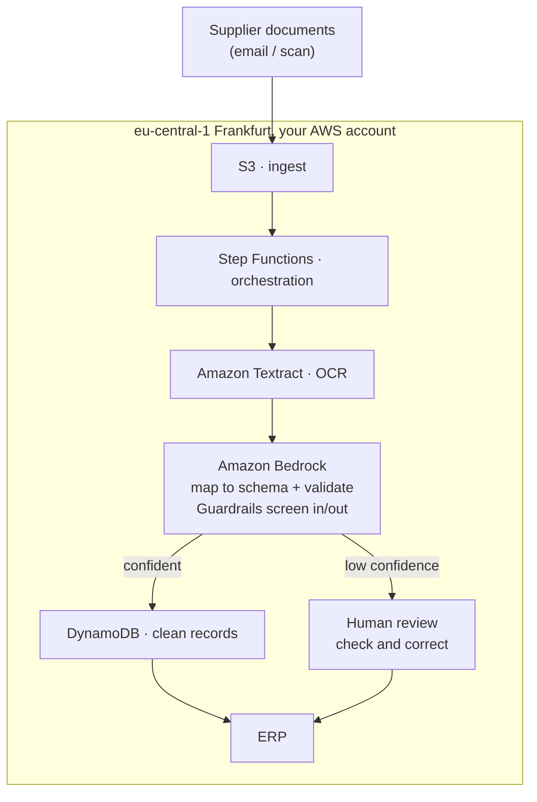

# 03 · Facilitator Field Guide

**AI Kickstart · superluminar GmbH**

This is the in-room reference you score *against*. It gathers, in workshop order, the readiness snapshot rubric, the use-case canvas, the data-check gate, the cost basis, and the reference architecture, so you have one document to judge from across the session. It holds the definitions, anchors, how-to-judge text, and the worked examples; it is not where you write the client's answers. Live capture goes in the client's row in the **AI Kickstart Engagements** Notion workbook. The session flow and timing live in `02-facilitator-runbook.md`. The report field spec (the five deliverables, the executive summary, the generator field map) lives in `04-report-outline.md`.

The frame holds throughout: **one use case, the data check is the gate, and a clear no beats an expensive maybe.**

---

## 1 · Readiness snapshot (the three lenses) · feeds D1

A **high-level read**, not the full assessment. This is a snapshot: enough to know whether the ground is ready for *this one build*, no more.

> **The deliverable is three status cards, not a scorecard.** D1 outputs **three cards (Platform, People, Compliance), each with a status label** (`Ready` / `Ready, with us alongside` / `Low burden` / `Partial` / `Gap`), not a 0–5 score. The full AI Readiness Workshop scores five dimensions in depth, across the organisation, for a portfolio of use cases. Here we read them **lightly** and **for one use case only** (the 0–5 read is an internal heuristic for the facilitator) and surface them as three plain-English status cards. If the client needs the full scorecard, that's the AI Readiness Workshop.

> **The real gate is not here.** The snapshot tells you whether the platform, people and compliance picture *allow* the build. Whether it *ships* is decided by the **use-case data check** (section 3 below). Keep the snapshot light and move on to the data.

### What the deliverable actually is: three cards, one status each

> **The output is a status label per card, not a score.** Deliverable D1 is **three readiness cards** (**Platform**, **People**, **Compliance**), and each card carries one **status label**, plus the area name and one or two honest lines. There is **no 0–5 score on the page.** The status is chosen from a fixed set:
>
> **Allowed status values:** `Ready` · `Ready, with us alongside` · `Low burden` · `Partial` · `Gap`
>
> Not every status fits every lens (see guidance per lens below). The report generator (route `/new/kickstart`) expects exactly this: three cards, each = Status + Area + one/two lines, then a **Verdict callout**.

### Internal heuristic only: a light 0–5 read (do not put on the page)

The five AI Readiness dimensions are still a useful **back-of-envelope** for the facilitator to decide which status each card should carry. Score them 0–5 in your notes if it helps, but this never appears in the deliverable. It is a private heuristic that feeds the status call.

| Dimension | What it reads | 0–2 (weak) | 3 (workable) | 4–5 (strong) |
|---|---|---|---|---|
| **Data** | Does the data this use case needs exist, and is it reachable? | Scattered, unknown quality, or not retained | Exists but messy or partly accessible | Available, retained, reachable for this use case |
| **Cloud & infrastructure** | Is the platform ready to host the build? | Not on AWS / no landing zone | On AWS, basic accounts & IAM | Mature: IaC, CI/CD, required services available |
| **Governance & compliance** | Can this use case clear GDPR / AI Act / residency? | Unclear ownership, high-risk processing | Standard controls, some questions open | Clear controls, low-risk use case, residency understood |
| **Skills** | Can the team run it after handover? | No relevant engineers | Engineers present, no ML/AI experience | Engineers + some AI awareness; can own it with us alongside |
| **Organisational appetite** | Does the team that feels the pain want the change? | Resistant or indifferent | Mixed; needs a sponsor | Keen, sponsored, ready to change the process |

> A `3` is genuinely fine for a Kickstart. Most clients sit at "Ready, with us alongside." The heuristic exists to surface real blockers, not to grade, and it stays in your notes, not the report.

### The three cards (this is what goes in the report)

Fold the heuristic into three cards for **this** use case. Each card = **Status** (from the allowed set) + **Area** (the lens) + a short, honest one/two lines. Mirror the example report's statuses.

#### Card 1 · Platform (is the ground ready?)
*Heuristic draws on: Cloud & infrastructure, Data (availability).*
**Status, choose one:** `Ready` · `Ready, with us alongside` · `Partial` · `Gap`

When each applies:
- **`Ready`:** on AWS, in the right region, every service this build needs available today; nothing to stand up first.
- **`Ready, with us alongside`:** on AWS and broadly capable, but a piece of platform setup (an account, a service enablement, a landing-zone tidy-up) is best done with us in the room.
- **`Partial`:** on AWS but missing something the build needs (a region, a service, a landing zone) that has to be stood up first; manageable, usually Phase 0.
- **`Gap`:** not on AWS, or no platform path to host this build yet; a real dependency to close before building.

> *Worked example (Brückner):* **Ready.** "You run on AWS in Frankfurt, and every service this build needs (Textract, Bedrock, Step Functions) is available to you today. Nothing to stand up first."

#### Card 2 · People (ready, with us alongside?)
*Heuristic draws on: Skills, Organisational appetite.*
**Status, choose one:** `Ready` · `Ready, with us alongside` · `Partial` · `Gap`

When each applies:
- **`Ready`:** process and platform owners understand it and can own it after handover with little hand-holding.
- **`Ready, with us alongside`:** the process and platform people are strong, but there's no ML-aware engineer in-house yet. That's **normal**: we build alongside and leave the knowledge. *(This is the typical Kickstart status for People.)*
- **`Partial`:** a sponsor or a key owner is missing or only half-committed; closeable, but name it.
- **`Gap`:** no one to own the process or the platform after handover, or active resistance; a real dependency to close.

> *Worked example (Brückner):* **Ready, with us alongside.** "Your ERP and accounts-payable teams know the process inside out. There is no ML-aware engineer in-house yet, so we build alongside them and leave the knowledge with you."

#### Card 3 · Compliance (what's the burden for this use case?)
*Heuristic draws on: Governance & compliance.*
**Status, choose one:** `Low burden` · `Partial` · `Gap`

When each applies:
- **`Low burden`:** little personal/sensitive data, assists rather than decides about people; standard EU controls, nothing high-risk under the AI Act.
- **`Partial`:** some open compliance questions (a DPIA to run, a residency detail to confirm, a controller/processor line to draw); standard controls plus a bit of care.
- **`Gap`:** high-risk processing or an AI-Act decision-about-people classification that needs resolving before the build can proceed.

> *Worked example (Brückner):* **Low burden.** "Invoices carry little personal data, and the use case assists people rather than deciding about them. Standard EU controls apply; nothing high-risk under the AI Act."

> **A note on the status set.** `Ready, with us alongside` reads naturally on Platform and People; on Compliance the gentle-positive status is `Low burden`. `Partial` and `Gap` are the honest "not yet" statuses on any lens. If you reach for them, say plainly what closes them (usually Phase 0). *A clear no beats an expensive maybe.*

### The snapshot summary and verdict

Live capture goes in the client's row in the AI Kickstart Engagements Notion workbook. Each card records a Status (one of `Ready` · `Ready, with us alongside` · `Low burden` · `Partial` · `Gap`, no 0–5 score on the page) and one or two honest lines, plus a one-line snapshot verdict.

**Snapshot verdict (one line):**
> e.g. *"Ready to build. The one real dependency is the data behind it, which the next page checks in detail."*

**Cross-sell (include if relevant):**
> *"If you want a fuller picture of your readiness across the organisation, and the other use cases worth building, that is what our AI Readiness Workshop is for."*

### Worked example · Brückner Hausgeräte GmbH (invoice extraction)

| Card (Area) | Status | One/two honest lines |
|---|---|---|
| **Platform** | **Ready** | You run on AWS in Frankfurt, and every service this build needs (Textract, Bedrock, Step Functions) is available to you today. Nothing to stand up first. |
| **People** | **Ready, with us alongside** | Your ERP and accounts-payable teams know the process inside out. There is no ML-aware engineer in-house yet, so we build alongside them and leave the knowledge with you. |
| **Compliance** | **Low burden** | Invoices carry little personal data, and the use case assists people rather than deciding about them. Standard EU controls apply; nothing high-risk under the AI Act. |

**Snapshot verdict:**
> *"Ready to build. Platform and people are in good shape, and the compliance burden is low for this use case. The one real dependency is the data behind it, which the next page checks in detail."*

*This snapshot is high-level by design. The decision lives in the data check (section 3 below).*

---

## 2 · Use-case canvas · feeds D2 & D5

One canvas for the **one** use case the client brought. It captures the problem deeply enough that the data check (section 3) and the recommended engagement (D5) almost write themselves. Be concrete. Vague answers here become hand-waving in the report.

Live capture goes in the client's row in the AI Kickstart Engagements Notion workbook. The canvas covers, for the one use case:

1. **The use case, in one sentence.** What you want to build.
2. **The problem.** What it solves; what it costs today (time, errors, delay, money); whether it is **assist** (helps a person) or **decide** (acts alone).
3. **The current process.** How it's done today, step by step; the manual/awkward steps; the bottleneck.
4. **Who feels it.** Which team/role feels the pain most; how keen they are to change it (low / mixed / high); who the sponsor / decision-maker is.
5. **The data it needs.** Each piece of data the build depends on (where it lives, format, notes); each line becomes a row in the data check. Plus: is there a labelled / ground-truth set and where correct answers would come from; any personal / sensitive / regulated data; where the data must stay (residency).
6. **The value.** The measurable benefit (hours saved, % automated, errors cut); rough volume (per day / month); what it's worth, roughly, if it works.
7. **"Good enough to ship".** The honest accuracy / coverage bar. What must be true for this to go live, and what can stay on human review.
8. **Integration points.** What system the result must land in / read from; whether there's a clean, permissioned API today or it's manual; who owns that system; other systems touched.
9. **Out of scope (for the first build).** What we deliberately leave for a fast follow.

### Probe lines (force the evidence)

Ask these live; don't accept the first answer. They keep the canvas concrete.

- **The current workaround and its cost.** Who does this by hand now, and what does that time or error actually cost? Get the number.
- **Volume and frequency.** How many per day or month, and how variable? "A lot" is not an answer.
- **The integration reality.** Is there a clean, permissioned write path today, or is this a manual step? Who can confirm it exists?
- **The cost of the failure mode.** When the output is wrong, what does it break, and who catches it? That sets the "good enough to ship" bar.

### Worked example · Brückner Hausgeräte GmbH (invoice extraction)

*Fictional client: Stuttgart home-appliance maker, ~850 employees, already on AWS.*

**1. The use case, in one sentence**
> Automate the data entry from incoming supplier invoices and delivery notes, which the accounts-payable (AP) team currently keys into the ERP by hand.

**2. The problem**

| Field | Answer |
|---|---|
| Problem | AP rekeys every supplier invoice and delivery note into the ERP manually: slow, costly, error-prone. |
| Cost today | Hours of skilled AP time daily; keying errors; processing delay. |
| Assist or decide? | **Assist.** High-confidence extractions post straight through; uncertain ones go to a person. |

**3. The current process**
> Invoices and delivery notes arrive by email and scan in volume every day. AP opens each one, reads the fields, and types them into the ERP by hand. Nothing structured comes out the other end automatically.

**4. Who feels it**

| Field | Answer |
|---|---|
| Who feels it | The accounts-payable team; they do the rekeying. |
| Keen to change? | **High**, keen to stop rekeying. |
| Sponsor | Finance / AP lead, with ERP team support. |

**5. The data it needs**

| Data the build needs | Where it lives | Format | Notes |
|---|---|---|---|
| Incoming invoices & delivery notes | Email + scans, retained | PDF / scanned images | Thousands per month, a strong real stream. |
| Correct field values (ground truth) | The ERP (values AP already keyed) | DB records | Pair with source docs → a labelled set. |
| Supplier format variety | Across the document stream | many layouts | Hundreds of supplier layouts; scan quality varies. |
| ERP write target | The ERP | API (none clean today) | No permission-controlled write path yet. |

| Field | Answer |
|---|---|
| Labelled set? | Not yet, but the ERP already holds the correct values; paired with source docs that *becomes* one. Main piece of Phase 0. |
| Personal/sensitive data? | Little. Invoices carry minimal personal data. |
| Residency | EU only: eu-central-1 (Frankfurt). |

**6. The value**

| Field | Answer |
|---|---|
| Benefit | Stop manual rekeying; faster, more accurate AP processing. |
| Volume | Thousands of documents per month. |
| Worth | Significant recurring AP time; modest run cost (~€800/mo at modest volume). |

**7. "Good enough to ship"**
> High-confidence extractions post straight through to the ERP with no one touching them; anything uncertain routes to a person to check and correct. A **measured accuracy bar per supplier segment** must clear before straight-through posting is trusted for that segment. If messier suppliers fall short, keep them on human review and automate the clean ones first.

**8. Integration points**

| Field | Answer |
|---|---|
| Result lands in | The ERP. |
| Clean API today? | No. Designing a clean, permission-controlled write path is the **second piece of Phase 0** (the Blocker). |
| Owner | The ERP team. |
| Other systems | S3 (ingest), DynamoDB (extracted records). |

**9. Out of scope (for the MVP)**
> Delivery notes and order confirmations (a fast follow once invoices work); full coverage of every supplier on day one; removing human review entirely (it stays for low-confidence documents).

---

## 3 · Data-check gate · feeds D2

This is the gate. The use case usually isn't in doubt: the *model* can do the task. What decides whether it **ships** is whether the data it needs actually exists, in usable shape, with a way to land the results. Work this row by row in step 2, with the **data owner** in the room.

> **A clear no beats an expensive maybe.** If a row is a Blocker, name it. A Blocker doesn't always kill the build, it usually becomes Phase 0 work, but it must be on the page, not glossed over.

### How to score each row

For each thing the build needs, assign a **State** and a "detail & what to do":

| State | Meaning |
|---|---|
| **Usable** | Exists, accessible, good enough to build and test on as-is. |
| **Partial** | Exists but incomplete: needs assembling, pairing, or filling. Often Phase 0 work. |
| **Messy** | Exists but variable (formats, quality). Manageable, but sets an accuracy bar to respect. |
| **Blocker** | Missing or unreachable in a way that stops the build until addressed. Usually becomes Phase 0. |

Pull the rows from the canvas (section 2, the data it needs). Aim for **~4 rows**: the things that actually decide it, not an inventory.

### Interrogate each row

Before you settle a State, push on the row with the data owner in front of you:

- **Lineage / source.** Where does this actually come from, and is that source the real one or a copy someone maintains by hand?
- **Who can read it.** Who has permissioned access today? Can we get the build a permissioned path, or is that a fight?
- **Freshness.** How current is it, and how often does it change? Stale data fails quietly.
- **The precise blocker.** If it's not Usable, name the exact thing in the way. "Messy" and "incomplete" are not blockers; the specific missing piece is.
- **Ground-truth set.** Is there a labelled or checked set to measure accuracy on *their* data? If not, where would the correct answers come from? (Usually a Kickstart gate.)
- **Write path.** Is there a clean, permissioned way to land results in the target system? Who confirms it exists? (The other usual gate.)

### The worksheet, and what it decides

Live capture goes in the client's row in the AI Kickstart Engagements Notion workbook. Each of the ~4 rows records what the build needs, a **State** (Usable / Partial / Messy / Blocker), and the detail with what to do about it. Two short reads sit under the table:

- **What actually decides this.** Strip it to the 1–2 real gates. Almost always: **(a)** a labelled set to prove accuracy on *their* data, and **(b)** a clean path to land the results. Name them and say which phase handles each.
- **The honest call.** If accuracy on the messier cases falls short, what's the right move? Usually: keep the messy ones on human review, automate the clean ones first, and you'll have the numbers to make that call yourself.

### Worked example · Brückner Hausgeräte GmbH (invoice extraction)

| What the build needs | State | Detail, and what to do about it |
|---|---|---|
| **Incoming invoices & delivery notes** | **Usable** | Thousands arrive each month by email and scan, and they are retained. A strong, real stream to build and test on. |
| **Correct field values (ground truth)** | **Partial** | Your ERP already holds the values your team keyed in. Paired with the source documents, that becomes a labelled set to measure accuracy. This pairing is the main piece of **Phase 0**. |
| **Format & supplier variety** | **Messy** | Hundreds of supplier layouts, and scan quality varies. Manageable, but it is why a measured accuracy bar per supplier segment matters before you trust straight-through posting. |
| **ERP write integration** | **Blocker** | There is no clean, permission-controlled way to post extracted data back into the ERP today. Without it the result is another manual step. Designing this integration is the second piece of **Phase 0**. |

**What actually decides this**
> Not whether AI can read an invoice. It can. The two things that decide success are a **labelled set** to prove accuracy on your own suppliers, and a **clean path to write results into the ERP**. Phase 0 delivers both before any extraction goes live.

**The honest call**
> If, on the labelled set, accuracy on your messier suppliers falls short, the right call is to keep those on human review and automate the clean ones first. You will have the numbers to make that call.

*This is the decision page. If the gate doesn't clear as-is, that's the honest "not yet", and exactly what the client is paying us to tell them.*

---

## 4 · Cost basis · feeds D4

Two outputs: the **delivery effort** (person-days, phased) and an **estimate of the monthly AWS run cost** (line by line). State your assumptions so the client can check them against their own numbers. Note who owns each number: delivery sizes the effort; the day rate and price are sales'; the run cost is AWS's pricing, which we only estimate.

> The kit does not set a day rate or a price. The rate and the one-off engagement price are owned by sales and are filled in with them when the report is compiled. Delivery brings the effort sizing and the run-cost estimate. The euro figures in the worked example are reproduced from the published example report to show order of magnitude, not a rate this kit asserts.

### Table A · One-off delivery effort (the basis)

Live capture goes in the client's row in the AI Kickstart Engagements Notion workbook. Estimate person-days, split **Phase 0** (de-risk: labelled set + integration / data prep) and **Phase 1** (build: pipeline + review loop). The generator's one-off table is *Item · Basis · Indicative*: delivery supplies Item and Basis (person-days); the Indicative euro is added with sales. Do not pre-fill a day rate.

### Table B · Estimated monthly AWS run cost (the line-item basis)

This is AWS's pricing, not ours. We estimate it from the architecture and the AWS Pricing Calculator so the client can plan; it moves with usage and AWS's own rates. Pick the line items that fit the pattern. The set below suits a **document-extraction** build; for a **RAG assistant**, swap Textract for the retrieval store (S3 Vectors or OpenSearch Serverless) and keep Bedrock tokens, compute, storage, logging.

| Line item | What it covers |
|---|---|
| **Amazon Textract** (AnalyzeExpense / AnalyzeDocument) | OCR, scales with pages per month. |
| **Amazon Bedrock** model tokens | Map to schema & validate, or generate answers. |
| **Compute: Step Functions + Lambda** | Per-document / per-request orchestration. |
| **Storage: S3 + DynamoDB** | Documents + extracted records. |
| **Logging: CloudWatch** | Standard retention. |
| _(RAG only)_ **Retrieval: S3 Vectors / OpenSearch Serverless** | Index size / query volume. |
| **Total** | The volume profile. |

**Where the cost sits.** Name the **cost driver** and what moves it. For extraction, **Textract scales with pages**: digital PDFs use a lighter mode than scans, so the run cost drops when more documents arrive as native PDFs. Size against the client's **real document mix**, not the worst case. For RAG, the driver is usually Bedrock tokens and the retrieval store.

### Worked example · Brückner Hausgeräte GmbH (invoice extraction)

**Table A · One-off delivery effort**

| Item | Basis (person-days) |
|---|---|
| **Invoice-extraction MVP: build and knowledge transfer** | 14 person-days |
| of which: **Phase 0** (labelled set + ERP integration) | ~5 person-days |
| of which: **Phase 1** (pipeline build & review loop) | ~9 person-days |

> The published example PDF prices this at ~€19,600. That euro figure is the published illustration only. In a real engagement the price comes from sales at their rate against these 14 person-days.

**Table B · Estimated monthly run cost (modest volume)**

| Line item | Assumption | Indicative / mo |
|---|---|---|
| **Amazon Textract** (AnalyzeExpense) | ~4,000–7,000 pages/mo | €350 – 700 |
| **Amazon Bedrock** model tokens | Map to schema & validate | €120 – 350 |
| **Compute: Step Functions + Lambda** | Per-document orchestration | €30 – 70 |
| **Storage: S3 + DynamoDB** | Documents + extracted records | €20 – 50 |
| **Logging: CloudWatch** | Standard retention | €20 – 40 |
| **Total** | Modest-volume run | **~€540 – 1,210** |

*(Run-cost headline quoted as ~€800/mo, mid-range of modest volume.)*

**Where the cost sits**
> Textract is the cost driver here, and it scales with pages. If most of your invoices arrive as digital PDFs rather than scans, a lighter Textract mode applies and the run cost drops. We size this against your real document mix rather than assuming the worst case.

### Headline (for the hero stat box in D5)

Delivery sizes Effort and Timeline and estimates the AWS run-cost range. The one-off price is compiled with sales.

| Field | Owner | Example value |
|---|---|---|
| Effort | delivery | **14 person-days** (incl. Phase 0) |
| Timeline | delivery | **~5 weeks** elapsed |
| Run cost | AWS pricing, we estimate | **~€800/mo** at modest volume |
| Indicative one-off (price) | sales | filled when compiling the report |

*Delivery sizes the effort and estimates the AWS run cost (AWS's pricing, not ours). The price is set with sales.*

---

## 5 · Reference architecture · feeds D3

Design the architecture for the use case in front of you. This space moves quickly and there is no fixed catalogue to pick from, so the build is shaped to the use case rather than chosen off a list. Keep it **AWS-native, managed by default, EU-resident**: a **person stays in the loop wherever the model is unsure**, and everything stays in **eu-central-1 (Frankfurt)**. The worked example below shows the shape and the depth to aim for.

> **Ship the editable source.** Draw the architecture as a diagram and provide the **editable draw.io source alongside the report**. The client owns it. *You own what we build.*

### Worked example · Brückner document-extraction pipeline

Pull structured fields out of documents (invoices, delivery notes, forms, contracts) and land them in a system of record. This is the Brückner build, kept here as the one worked example of the shape and depth to aim for. It uses Textract for OCR, which suits invoices at volume; another use case might have the multimodal model read the document directly. Design to the case.

#### Flow

#### Components

| Component | Role |
|---|---|
| **Amazon S3** | Documents land here on arrival (ingest). |
| **AWS Step Functions** | Orchestrates each document through the pipeline. |
| **Amazon Textract** | OCR. Turns the document into machine-readable text/fields (AnalyzeExpense for invoices). |
| **Amazon Bedrock** | Maps the OCR result onto your schema and validates it. |
| **Amazon Bedrock Guardrails** | Screens what the model reads and returns, e.g. catches prompt-injection text hidden inside a document. |
| **Amazon DynamoDB** | Stores the clean extracted records. |
| **Target system (ERP/DB)** | Where clean records are posted, via a permission-controlled write path. |
| **AWS Lambda** | Glue / per-document transforms within the Step Functions flow. |
| **Amazon CloudWatch** | Logs every step for observability and audit. |
| **AWS IAM** | Least-privilege access throughout. |

#### The straight-through path
> Documents land in S3. Step Functions runs each one through Textract for OCR, then Bedrock maps the result onto the invoice schema and validates it. When the model is **confident**, the clean record goes to DynamoDB and on to the ERP. **No one touches it.**

#### The exception path
> When **confidence is low**, the document goes to a **person to check and correct** before it posts. That keeps accuracy honest and gives you the data to widen straight-through over time. At the Bedrock step, **Guardrails** screen what the model reads and returns (e.g. prompt-injection hidden in a document). Across the pipeline, **CloudWatch** logs every step and **IAM** keeps access least-privilege. **Everything stays in the EU.**

### EU residency & controls

- Runs in the client's existing **eu-central-1 (Frankfurt)** account: a compliant build sits on what they already have.
- **Data stays in the EU** end to end.
- **IAM least-privilege** and **CloudWatch** logging across the pipeline.
- **Bedrock Guardrails** screen model input/output (prompt-injection, unsafe content).
- Assist-not-decide keeps most use cases **low-risk under the EU AI Act**; confirm per use case in D1.

### Diagram handover

Draw the architecture you design for the report and **provide the editable draw.io source alongside**. Annotate the straight-through path, the exception (human-in-the-loop) path, the Guardrails point, and the EU-residency boundary. Caption it like the example: *"Document extraction pipeline on AWS. Editable draw.io source provided alongside this report."*
